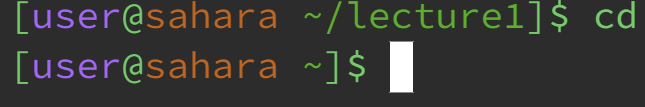
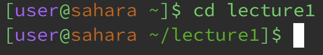
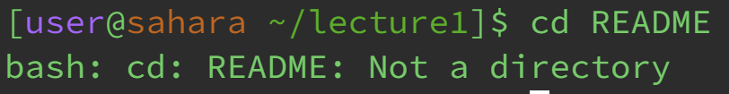
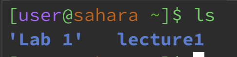
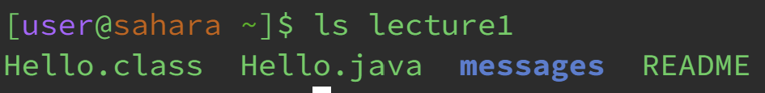
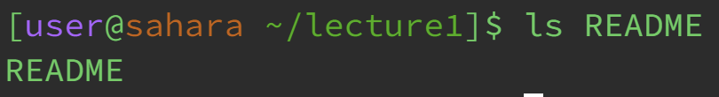
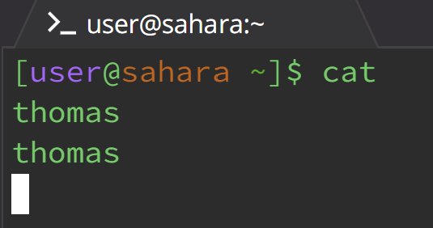
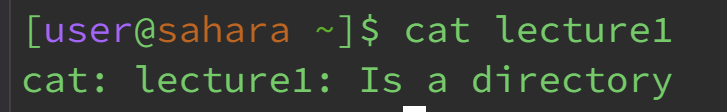
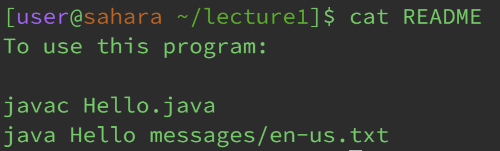

## cd
* No arguments  
  
The working directory is `/home/lecture1`. Using this command while in this directory functioned to exit out, bringing the working directory to become `/home`. So, it seems that if we are in a working directory outside of `/home`, `cd` without an argument changes to `/home`. This is not an error. <d>
* Directory path  
  
The working directory is `/home`. This command changed our working directory to become `/home/lecture1`, as seen with how it now states `[user@sahara ~ /lecture1`. So the directory argument changes the working directory to that of the argument. This is not an error.  
* File path  
  
The working directory is `/home/lecture1`. This command with a file returned an error. This is because the command in meant to use to change directories, meaning that we can not use it to change our directory to be a file. As such, the terminal prints out that the error that `README` is not a directory.  
## ls
* No arguments  
  
The working directory is `/home`. This command gave a list of two folders within our working directory, which included `'Lab 1'` and `lecture1`. These are the two folders that we can access from the `/home` working directory. This is not an error. <d>
* Directory path  
  
The working directory is `/home`. This command displayed the files and folders within the `lecture1` directory. So, it acts as a list to see the names of all files and folders within the directory. This is not an error.  
* File path  
  
The working directory is `/home/lecture1`. Using this command on an existing file, which I used `README`, just listed that one file. This is seen with how the terminal displayed `README` as the result. This is not an error.  
## cat
* No arguments  
  
The working directory is `/home/lecture1`. This command takes away the `[user@sahara ~ /lecture1`, and allows the user to type in the input directly in the terminal. Then, it prints out input that was typed into the terminal. This is not an error. <d>
* Directory path  
  
The working directory is `/home`. This command is an error, which is displayed in the terminal, where it states that `lecture1` is a directory, not a file. `Cat` takes files, not directories, to print in the terminal, so using a directory in the argument will not work.  
* File path  
  
The working directory is `/home/lecture1`. This command with a file functioned to display the contents of the file. So, using the `README` file as an argument, this displayed what was written in the file within the terminal. This is not an error.  
